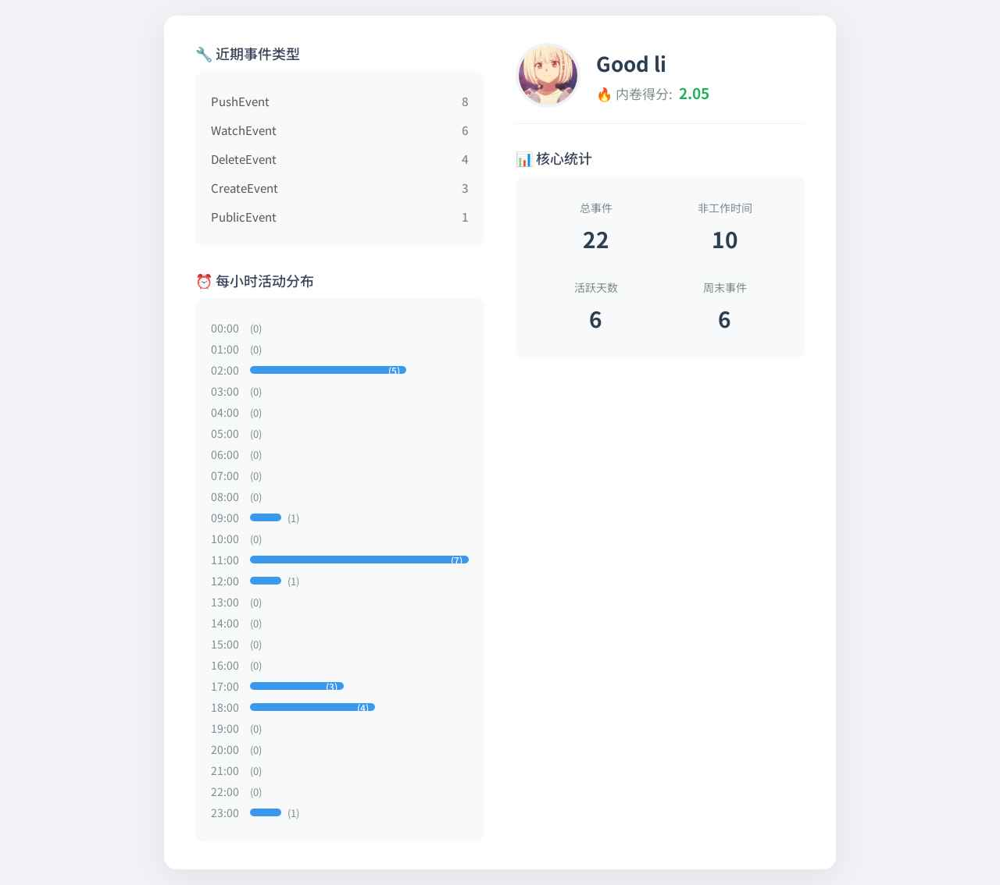

<div align="center">

# GitHub Grind Analyzer for AstrBot

[](https://www.python.org/)
[](https://github.com/AstrBotDevs/AstrBot)
[](LICENSE)
[](https://github.com/GeneralK1ng/Grind-Checker)

**一个为 [AstrBot](https://github.com/AstrBotDevs/AstrBot) 设计的插件，用于分析 GitHub 用户的近期活动，并生成一张精美的“内卷”报告卡。**

</div>

---

## ✨ 功能预览




---

## 🚀 特性

- **可视化报告**：将用户的 GitHub 活动数据渲染成一张清晰、美观的图片。
- **“内卷”得分**：根据非工作时间、午夜和周末的活动计算出一个有趣的“内卷得分”。
- **活动统计**：展示总事件数、非工作时间活动、活跃天数和周末活动等核心指标。
- **完整的事件类型分析**：列出指定时间范围内，用户所有的公开活动类型及其计数。
- **每小时活动分布**：通过条形图直观展示用户在一天 24 小时内的活动热力图。
- **高度可配置**：你可以自定义工作时间的起止、数据分析的时间范围等。

## 📦 安装

1.  确保你已经成功安装并运行了 [AstrBot](https://github.com/AstrBotDevs/AstrBot)。
2.  将本插件文件夹放入 AstrBot 的 `plugins` 目录下。
3.  重启 AstrBot，插件将被自动加载。

## ⚙️ 配置

在使用前，你需要在 AstrBot 插件配置管理中添加 GitHub Personal Access Token

用于提高 API 请求速率限制。只需 public_repo 权限即可。


**重要提示**：强烈建议配置 `github_token`。未经身份验证的 GitHub API 请求有非常严格的速率限制（每小时 60 次），很容易耗尽。

## 📝 使用方法

支持三种命令格式，以满足不同的分析需求：

| 命令格式                                       | 说明                                           |
| ---------------------------------------------- | ---------------------------------------------- |
| `/gh_analyze <用户名>`                         | 分析默认天数（如最近7天）内的活动。            |
| `/gh_analyze <用户名> <天数>`                  | 分析最近 `N` 天内的活动。                      |
| `/gh_analyze <用户名> <起始天数> <截止天数>` | 分析从 `A` 天前到 `B` 天前这个时间范围内的活动。 |

---

#### 示例 1：基础用法

分析用户 `Soulter` 最近7天的活动。

```
/gh_analyze Soulter
```

---

#### 示例 2：指定最近天数

分析用户 `lxfight` 最近30天的活动。

```
/gh_analyze lxfight 30
```

---

#### 示例 3：指定时间范围

分析用户 `RC-CHN` 从14天前到7天前的活动。

```
/gh_analyze RC-CHN 14 7
```

机器人会根据你的指令进行分析，然后返回一张报告图片。

## 🙏 致谢

本项目的开发灵感来源于 [GeneralK1ng](https://github.com/GeneralK1ng) 的 [Grind-Checker](https://github.com/GeneralK1ng/Grind-Checker) 项目。我们对原作者的创意和开源贡献表示诚挚的感谢！

同时，感谢 [AstrBot](https://github.com/AstrBotDevs/AstrBot) 框架提供了强大的插件化能力。

关于所使用的第三方组件的详细许可证信息，请参阅 `NOTICE.md` 文件。

## 📜 开源许可

本项目采用 [MIT License](LICENSE) 开源。
